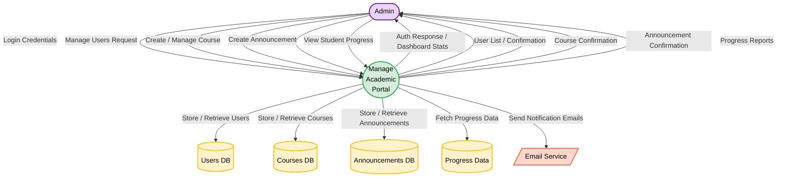

# 1st Level (Admin) DFD

## Smart Learn - Academic Portal System

```mermaid
graph TD
    %% External Entities
    Admin([Admin])
    Users[(Users DB)]
    Courses[(Courses DB)]
    Announcements[(Announcements DB)]
    Email[/Email Service/]
    Progress[(Progress Data)]

    %% Central Process
    ManagePortal((Manage\nAcademic\nPortal))

    %% Admin to System Flows
    Admin -->|Login Credentials| ManagePortal
    ManagePortal -->|Auth Response / Dashboard Stats| Admin

    Admin -->|Manage Users Request| ManagePortal
    ManagePortal -->|User List / Confirmation| Admin

    Admin -->|Create / Manage Course| ManagePortal
    ManagePortal -->|Course Confirmation| Admin

    Admin -->|Create Announcement| ManagePortal
    ManagePortal -->|Announcement Confirmation| Admin

    Admin -->|View Student Progress| ManagePortal
    ManagePortal -->|Progress Reports| Admin

    %% System to Data Stores
    ManagePortal -->|Store / Retrieve Users| Users
    ManagePortal -->|Store / Retrieve Courses| Courses
    ManagePortal -->|Store / Retrieve Announcements| Announcements
    ManagePortal -->|Fetch Progress Data| Progress
    ManagePortal -->|Send Notification Emails| Email

    %% Styling
    style ManagePortal fill:#d4edda,stroke:#28a745,stroke-width:2px,color:#000
    style Admin fill:#e8d5f5,stroke:#7b2d8e,stroke-width:2px,color:#000
    style Users fill:#fff3cd,stroke:#ffc107,stroke-width:2px,color:#000
    style Courses fill:#fff3cd,stroke:#ffc107,stroke-width:2px,color:#000
    style Announcements fill:#fff3cd,stroke:#ffc107,stroke-width:2px,color:#000
    style Progress fill:#fff3cd,stroke:#ffc107,stroke-width:2px,color:#000
    style Email fill:#ffd6cc,stroke:#ff6347,stroke-width:2px,color:#000
```
