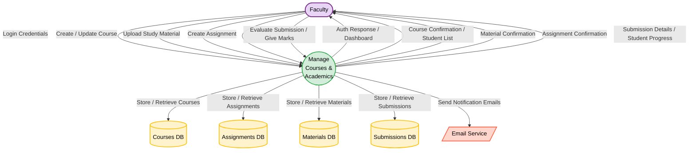

# 1st Level (Faculty) DFD

## Smart Learn - Academic Portal System

```mermaid
graph TD
    %% External Entities
    Faculty([Faculty])
    Courses[(Courses DB)]
    Assignments[(Assignments DB)]
    Materials[(Materials DB)]
    Submissions[(Submissions DB)]
    Email[/Email Service/]

    %% Central Process
    ManageCourses((Manage\nCourses &\nAcademics))

    %% Faculty to System Flows
    Faculty -->|Login Credentials| ManageCourses
    ManageCourses -->|Auth Response / Dashboard| Faculty

    Faculty -->|Create / Update Course| ManageCourses
    ManageCourses -->|Course Confirmation / Student List| Faculty

    Faculty -->|Upload Study Material| ManageCourses
    ManageCourses -->|Material Confirmation| Faculty

    Faculty -->|Create Assignment| ManageCourses
    ManageCourses -->|Assignment Confirmation| Faculty

    Faculty -->|Evaluate Submission / Give Marks| ManageCourses
    ManageCourses -->|Submission Details / Student Progress| Faculty

    %% System to Data Stores
    ManageCourses -->|Store / Retrieve Courses| Courses
    ManageCourses -->|Store / Retrieve Assignments| Assignments
    ManageCourses -->|Store / Retrieve Materials| Materials
    ManageCourses -->|Store / Retrieve Submissions| Submissions
    ManageCourses -->|Send Notification Emails| Email

    %% Styling
    style ManageCourses fill:#d4edda,stroke:#28a745,stroke-width:2px,color:#000
    style Faculty fill:#e8d5f5,stroke:#7b2d8e,stroke-width:2px,color:#000
    style Courses fill:#fff3cd,stroke:#ffc107,stroke-width:2px,color:#000
    style Assignments fill:#fff3cd,stroke:#ffc107,stroke-width:2px,color:#000
    style Materials fill:#fff3cd,stroke:#ffc107,stroke-width:2px,color:#000
    style Submissions fill:#fff3cd,stroke:#ffc107,stroke-width:2px,color:#000
    style Email fill:#ffd6cc,stroke:#ff6347,stroke-width:2px,color:#000
```
