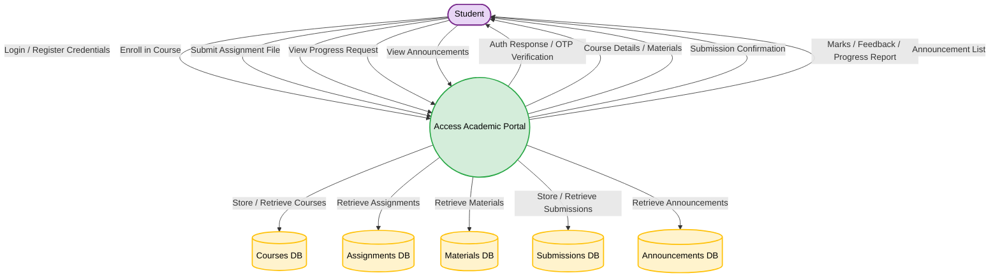

# 1st Level (Student) DFD

## Smart Learn - Academic Portal System

```mermaid
graph TD
    %% External Entities
    Student([Student])
    Courses[(Courses DB)]
    Assignments[(Assignments DB)]
    Materials[(Materials DB)]
    Submissions[(Submissions DB)]
    Announcements[(Announcements DB)]

    %% Central Process
    AccessPortal((Access Academic Portal))

    %% Student to System Flows
    Student -->|Login / Register Credentials| AccessPortal
    AccessPortal -->|Auth Response / OTP Verification| Student

    Student -->|Enroll in Course| AccessPortal
    AccessPortal -->|Course Details / Materials| Student

    Student -->|Submit Assignment File| AccessPortal
    AccessPortal -->|Submission Confirmation| Student

    Student -->|View Progress Request| AccessPortal
    AccessPortal -->|Marks / Feedback / Progress Report| Student

    Student -->|View Announcements| AccessPortal
    AccessPortal -->|Announcement List| Student

    %% System to Data Stores
    AccessPortal -->|Store / Retrieve Courses| Courses
    AccessPortal -->|Retrieve Assignments| Assignments
    AccessPortal -->|Retrieve Materials| Materials
    AccessPortal -->|Store / Retrieve Submissions| Submissions
    AccessPortal -->|Retrieve Announcements| Announcements

    %% Styling
    style AccessPortal fill:#d4edda,stroke:#28a745,stroke-width:2px,color:#000
    style Student fill:#e8d5f5,stroke:#7b2d8e,stroke-width:2px,color:#000
    style Courses fill:#fff3cd,stroke:#ffc107,stroke-width:2px,color:#000
    style Assignments fill:#fff3cd,stroke:#ffc107,stroke-width:2px,color:#000
    style Materials fill:#fff3cd,stroke:#ffc107,stroke-width:2px,color:#000
    style Submissions fill:#fff3cd,stroke:#ffc107,stroke-width:2px,color:#000
    style Announcements fill:#fff3cd,stroke:#ffc107,stroke-width:2px,color:#000
```
