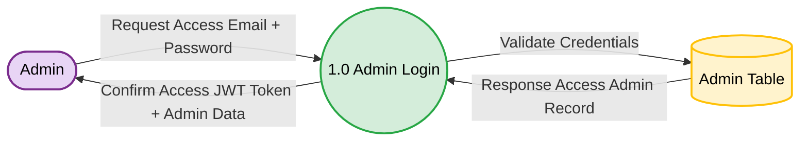

# 2nd Level Login (Admin) DFD

## Smart Learn - Academic Portal System

```mermaid
graph LR
    %% External Entities
    Admin([Admin])
    AdminDB[(Admin Table)]

    %% Process
    Login((1.0 Admin Login))

    %% Flows
    Admin -->|Request Access Email + Password| Login
    Login -->|Confirm Access JWT Token + Admin Data| Admin

    Login -->|Validate Credentials| AdminDB
    AdminDB -->|Response Access Admin Record| Login

    %% Styling
    style Login fill:#d4edda,stroke:#28a745,stroke-width:2px,color:#000
    style Admin fill:#e8d5f5,stroke:#7b2d8e,stroke-width:2px,color:#000
    style AdminDB fill:#fff3cd,stroke:#ffc107,stroke-width:2px,color:#000
```
