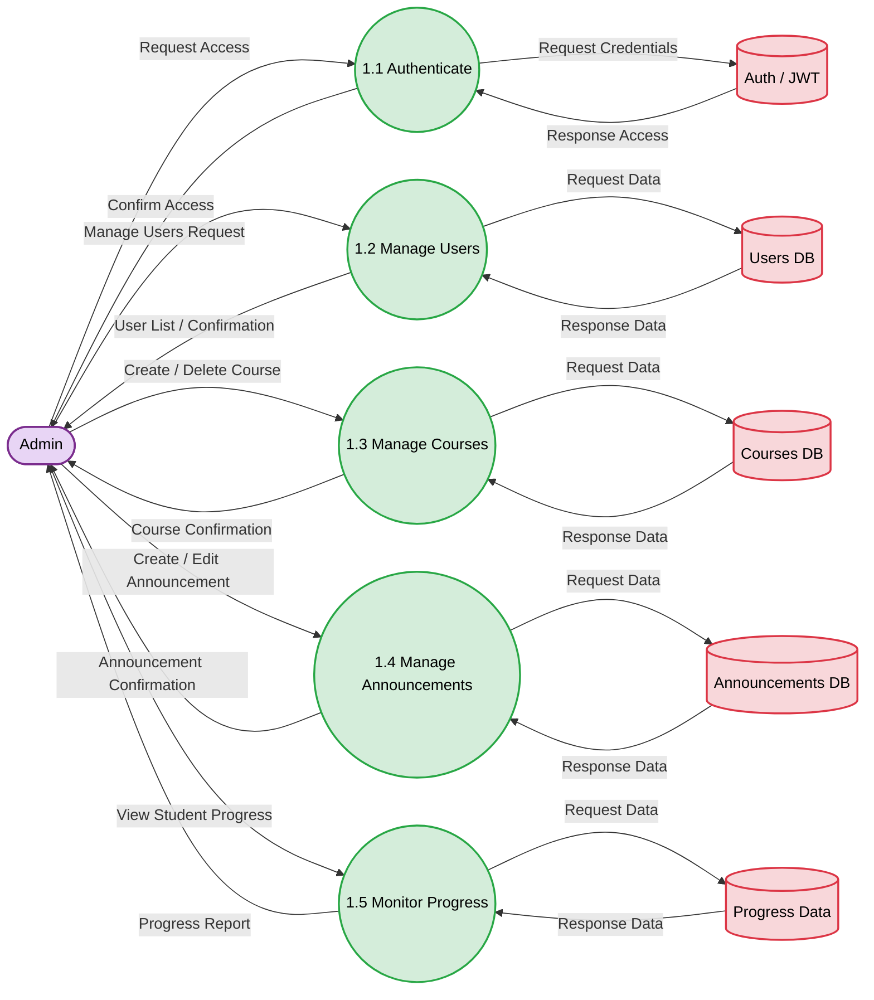

# 2nd Level Management (Admin) DFD

## Smart Learn - Academic Portal System

```mermaid
graph LR
    %% External Entity
    Admin([Admin])

    %% Data Stores
    LoginDB[(Auth / JWT)]
    UsersDB[(Users DB)]
    CoursesDB[(Courses DB)]
    AnnouncementsDB[(Announcements DB)]
    ProgressDB[(Progress Data)]

    %% Processes
    AuthProc((1.1 Authenticate))
    UsersProc((1.2 Manage Users))
    CoursesProc((1.3 Manage Courses))
    AnnouncementsProc((1.4 Manage Announcements))
    ProgressProc((1.5 Monitor Progress))

    %% Auth Flows
    Admin -->|Request Access| AuthProc
    AuthProc -->|Confirm Access| Admin
    AuthProc -->|Request Credentials| LoginDB
    LoginDB -->|Response Access| AuthProc

    %% Users Flows
    Admin -->|Manage Users Request| UsersProc
    UsersProc -->|User List / Confirmation| Admin
    UsersProc -->|Request Data| UsersDB
    UsersDB -->|Response Data| UsersProc

    %% Courses Flows
    Admin -->|Create / Delete Course| CoursesProc
    CoursesProc -->|Course Confirmation| Admin
    CoursesProc -->|Request Data| CoursesDB
    CoursesDB -->|Response Data| CoursesProc

    %% Announcements Flows
    Admin -->|Create / Edit Announcement| AnnouncementsProc
    AnnouncementsProc -->|Announcement Confirmation| Admin
    AnnouncementsProc -->|Request Data| AnnouncementsDB
    AnnouncementsDB -->|Response Data| AnnouncementsProc

    %% Progress Flows
    Admin -->|View Student Progress| ProgressProc
    ProgressProc -->|Progress Report| Admin
    ProgressProc -->|Request Data| ProgressDB
    ProgressDB -->|Response Data| ProgressProc

    %% Styling
    style Admin fill:#e8d5f5,stroke:#7b2d8e,stroke-width:2px,color:#000
    style AuthProc fill:#d4edda,stroke:#28a745,stroke-width:2px,color:#000
    style UsersProc fill:#d4edda,stroke:#28a745,stroke-width:2px,color:#000
    style CoursesProc fill:#d4edda,stroke:#28a745,stroke-width:2px,color:#000
    style AnnouncementsProc fill:#d4edda,stroke:#28a745,stroke-width:2px,color:#000
    style ProgressProc fill:#d4edda,stroke:#28a745,stroke-width:2px,color:#000
    style LoginDB fill:#f8d7da,stroke:#dc3545,stroke-width:2px,color:#000
    style UsersDB fill:#f8d7da,stroke:#dc3545,stroke-width:2px,color:#000
    style CoursesDB fill:#f8d7da,stroke:#dc3545,stroke-width:2px,color:#000
    style AnnouncementsDB fill:#f8d7da,stroke:#dc3545,stroke-width:2px,color:#000
    style ProgressDB fill:#f8d7da,stroke:#dc3545,stroke-width:2px,color:#000
```
