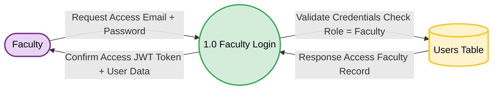

# 2nd Level Login (Faculty) DFD

## Smart Learn - Academic Portal System

```mermaid
graph LR
    %% External Entities
    Faculty([Faculty])
    UsersDB[(Users Table)]

    %% Process
    Login((1.0 Faculty Login))

    %% Flows
    Faculty -->|Request Access Email + Password| Login
    Login -->|Confirm Access JWT Token + User Data| Faculty

    Login -->|Validate Credentials Check Role = Faculty| UsersDB
    UsersDB -->|Response Access Faculty Record| Login

    %% Styling
    style Login fill:#d4edda,stroke:#28a745,stroke-width:2px,color:#000
    style Faculty fill:#e8d5f5,stroke:#7b2d8e,stroke-width:2px,color:#000
    style UsersDB fill:#fff3cd,stroke:#ffc107,stroke-width:2px,color:#000
```
