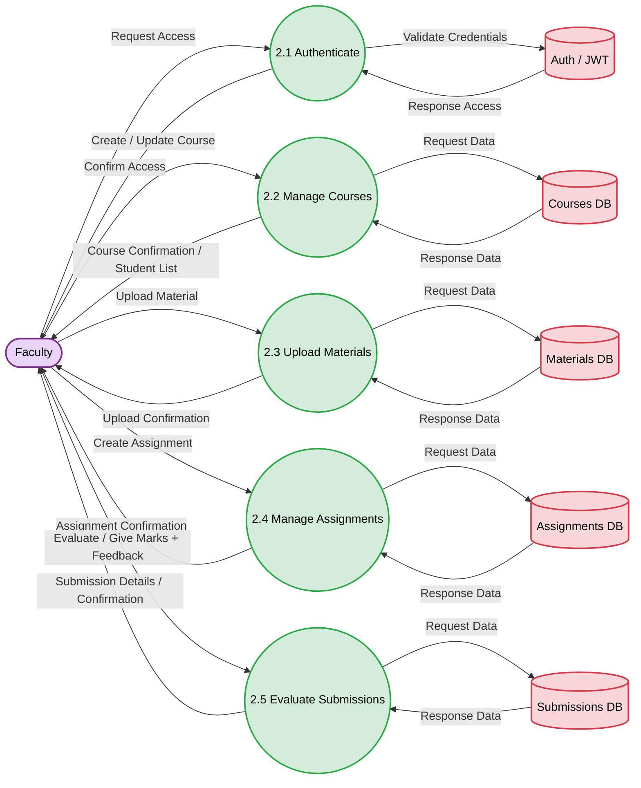

# 2nd Level Management (Faculty) DFD

## Smart Learn - Academic Portal System

```mermaid
graph LR
    %% External Entity
    Faculty([Faculty])

    %% Data Stores
    LoginDB[(Auth / JWT)]
    CoursesDB[(Courses DB)]
    MaterialsDB[(Materials DB)]
    AssignmentsDB[(Assignments DB)]
    SubmissionsDB[(Submissions DB)]

    %% Processes
    AuthProc((2.1 Authenticate))
    CoursesProc((2.2 Manage Courses))
    MaterialsProc((2.3 Upload Materials))
    AssignmentsProc((2.4 Manage Assignments))
    EvaluateProc((2.5 Evaluate Submissions))

    %% Auth Flows
    Faculty -->|Request Access| AuthProc
    AuthProc -->|Confirm Access| Faculty
    AuthProc -->|Validate Credentials| LoginDB
    LoginDB -->|Response Access| AuthProc

    %% Courses Flows
    Faculty -->|Create / Update Course| CoursesProc
    CoursesProc -->|Course Confirmation / Student List| Faculty
    CoursesProc -->|Request Data| CoursesDB
    CoursesDB -->|Response Data| CoursesProc

    %% Materials Flows
    Faculty -->|Upload Material| MaterialsProc
    MaterialsProc -->|Upload Confirmation| Faculty
    MaterialsProc -->|Request Data| MaterialsDB
    MaterialsDB -->|Response Data| MaterialsProc

    %% Assignments Flows
    Faculty -->|Create Assignment| AssignmentsProc
    AssignmentsProc -->|Assignment Confirmation| Faculty
    AssignmentsProc -->|Request Data| AssignmentsDB
    AssignmentsDB -->|Response Data| AssignmentsProc

    %% Evaluation Flows
    Faculty -->|Evaluate / Give Marks + Feedback| EvaluateProc
    EvaluateProc -->|Submission Details / Confirmation| Faculty
    EvaluateProc -->|Request Data| SubmissionsDB
    SubmissionsDB -->|Response Data| EvaluateProc

    %% Styling
    style Faculty fill:#e8d5f5,stroke:#7b2d8e,stroke-width:2px,color:#000
    style AuthProc fill:#d4edda,stroke:#28a745,stroke-width:2px,color:#000
    style CoursesProc fill:#d4edda,stroke:#28a745,stroke-width:2px,color:#000
    style MaterialsProc fill:#d4edda,stroke:#28a745,stroke-width:2px,color:#000
    style AssignmentsProc fill:#d4edda,stroke:#28a745,stroke-width:2px,color:#000
    style EvaluateProc fill:#d4edda,stroke:#28a745,stroke-width:2px,color:#000
    style LoginDB fill:#f8d7da,stroke:#dc3545,stroke-width:2px,color:#000
    style CoursesDB fill:#f8d7da,stroke:#dc3545,stroke-width:2px,color:#000
    style MaterialsDB fill:#f8d7da,stroke:#dc3545,stroke-width:2px,color:#000
    style AssignmentsDB fill:#f8d7da,stroke:#dc3545,stroke-width:2px,color:#000
    style SubmissionsDB fill:#f8d7da,stroke:#dc3545,stroke-width:2px,color:#000
```
