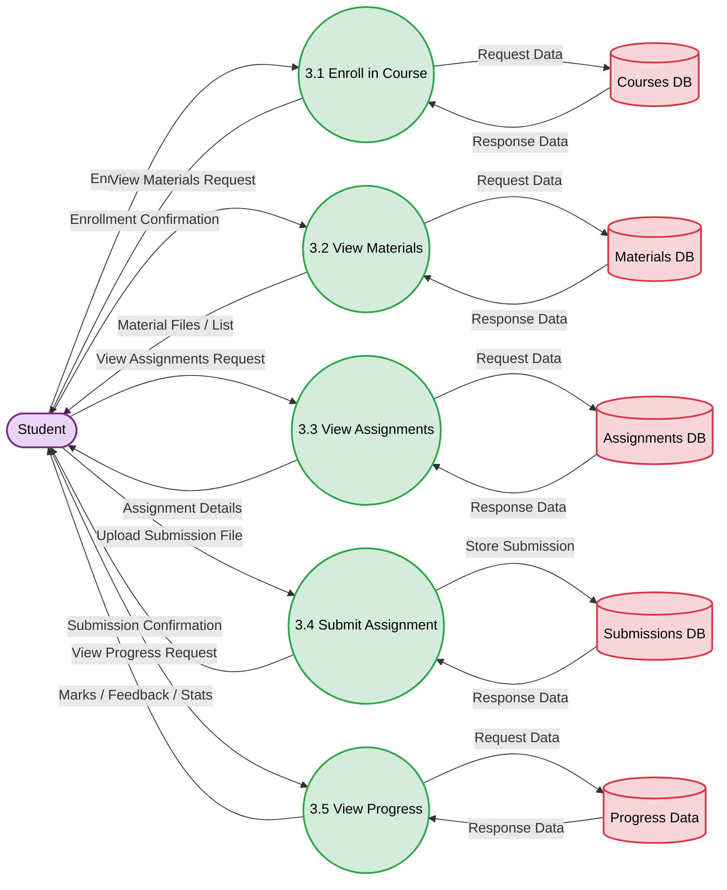

# 2nd Level Academics (Student) DFD

## Smart Learn - Academic Portal System

```mermaid
graph LR
    %% External Entity
    Student([Student])

    %% Data Stores
    CoursesDB[(Courses DB)]
    MaterialsDB[(Materials DB)]
    AssignmentsDB[(Assignments DB)]
    SubmissionsDB[(Submissions DB)]
    ProgressDB[(Progress Data)]

    %% Processes
    EnrollProc((3.1 Enroll in Course))
    MaterialsProc((3.2 View Materials))
    AssignmentsProc((3.3 View Assignments))
    SubmitProc((3.4 Submit Assignment))
    ProgressProc((3.5 View Progress))

    %% Enroll Flows
    Student -->|Enroll Request| EnrollProc
    EnrollProc -->|Enrollment Confirmation| Student
    EnrollProc -->|Request Data| CoursesDB
    CoursesDB -->|Response Data| EnrollProc

    %% Materials Flows
    Student -->|View Materials Request| MaterialsProc
    MaterialsProc -->|Material Files / List| Student
    MaterialsProc -->|Request Data| MaterialsDB
    MaterialsDB -->|Response Data| MaterialsProc

    %% Assignments Flows
    Student -->|View Assignments Request| AssignmentsProc
    AssignmentsProc -->|Assignment Details| Student
    AssignmentsProc -->|Request Data| AssignmentsDB
    AssignmentsDB -->|Response Data| AssignmentsProc

    %% Submit Flows
    Student -->|Upload Submission File| SubmitProc
    SubmitProc -->|Submission Confirmation| Student
    SubmitProc -->|Store Submission| SubmissionsDB
    SubmissionsDB -->|Response Data| SubmitProc

    %% Progress Flows
    Student -->|View Progress Request| ProgressProc
    ProgressProc -->|Marks / Feedback / Stats| Student
    ProgressProc -->|Request Data| ProgressDB
    ProgressDB -->|Response Data| ProgressProc

    %% Styling
    style Student fill:#e8d5f5,stroke:#7b2d8e,stroke-width:2px,color:#000
    style EnrollProc fill:#d4edda,stroke:#28a745,stroke-width:2px,color:#000
    style MaterialsProc fill:#d4edda,stroke:#28a745,stroke-width:2px,color:#000
    style AssignmentsProc fill:#d4edda,stroke:#28a745,stroke-width:2px,color:#000
    style SubmitProc fill:#d4edda,stroke:#28a745,stroke-width:2px,color:#000
    style ProgressProc fill:#d4edda,stroke:#28a745,stroke-width:2px,color:#000
    style CoursesDB fill:#f8d7da,stroke:#dc3545,stroke-width:2px,color:#000
    style MaterialsDB fill:#f8d7da,stroke:#dc3545,stroke-width:2px,color:#000
    style AssignmentsDB fill:#f8d7da,stroke:#dc3545,stroke-width:2px,color:#000
    style SubmissionsDB fill:#f8d7da,stroke:#dc3545,stroke-width:2px,color:#000
    style ProgressDB fill:#f8d7da,stroke:#dc3545,stroke-width:2px,color:#000
```
