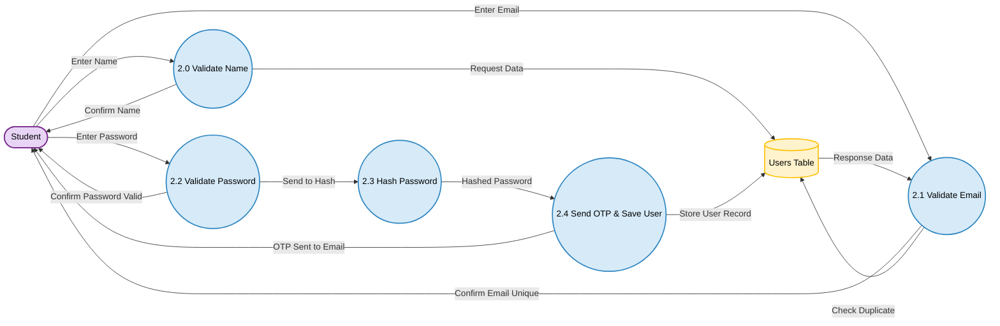

# 2nd Level Registration (Student) DFD

## Smart Learn - Academic Portal System

```mermaid
graph LR
    %% External Entities
    Student([Student])

    %% Data Stores
    UsersDB[(Users Table)]

    %% Processes
    ValidateName((2.0 Validate Name))
    ValidateEmail((2.1 Validate Email))
    ValidatePassword((2.2 Validate Password))
    HashPassword((2.3 Hash Password))
    SendOTP((2.4 Send OTP & Save User))

    %% Student to Processes
    Student -->|Enter Name| ValidateName
    ValidateName -->|Confirm Name| Student

    Student -->|Enter Email| ValidateEmail
    ValidateEmail -->|Confirm Email Unique| Student

    Student -->|Enter Password| ValidatePassword
    ValidatePassword -->|Confirm Password Valid| Student

    %% Process Chain
    ValidateName -->|Request Data| UsersDB
    ValidateEmail -->|Check Duplicate| UsersDB
    UsersDB -->|Response Data| ValidateEmail

    ValidatePassword -->|Send to Hash| HashPassword
    HashPassword -->|Hashed Password| SendOTP

    SendOTP -->|Store User Record| UsersDB
    SendOTP -->|OTP Sent to Email| Student

    %% Styling
    style Student fill:#e8d5f5,stroke:#7b2d8e,stroke-width:2px,color:#000
    style ValidateName fill:#d6eaf8,stroke:#2e86c1,stroke-width:2px,color:#000
    style ValidateEmail fill:#d6eaf8,stroke:#2e86c1,stroke-width:2px,color:#000
    style ValidatePassword fill:#d6eaf8,stroke:#2e86c1,stroke-width:2px,color:#000
    style HashPassword fill:#d6eaf8,stroke:#2e86c1,stroke-width:2px,color:#000
    style SendOTP fill:#d6eaf8,stroke:#2e86c1,stroke-width:2px,color:#000
    style UsersDB fill:#fff3cd,stroke:#ffc107,stroke-width:2px,color:#000
```
