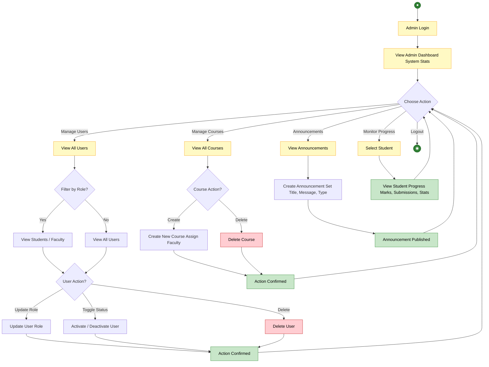

# Activity Flow Diagram - Admin Management Process

## Smart Learn - Academic Portal System

```mermaid
flowchart TD
    Start(("●"))

    Login["Admin Login"]
    Dashboard["View Admin Dashboard System Stats"]

    ChooseAction{"Choose Action"}

    %% User Management Branch
    ManageUsers["View All Users"]
    FilterUsers{"Filter by Role?"}
    ViewFiltered["View Students / Faculty"]
    ViewAll["View All Users"]
    UserAction{"User Action?"}
    UpdateRole["Update User Role"]
    ToggleActive["Activate / Deactivate User"]
    DeleteUser["Delete User"]
    UserConfirm["Action Confirmed"]

    %% Course Management Branch
    ManageCourses["View All Courses"]
    CourseAction{"Course Action?"}
    CreateCourse["Create New Course Assign Faculty"]
    DeleteCourse["Delete Course"]
    CourseConfirm["Action Confirmed"]

    %% Announcement Branch
    ManageAnnouncements["View Announcements"]
    CreateAnnouncement["Create Announcement Set Title, Message, Type"]
    AnnounceConfirm["Announcement Published"]

    %% Progress Branch
    MonitorProgress["Select Student"]
    ViewProgress["View Student Progress Marks, Submissions, Stats"]

    End(("◉"))

    %% Flow
    Start --> Login
    Login --> Dashboard
    Dashboard --> ChooseAction

    ChooseAction -->|Manage Users| ManageUsers
    ChooseAction -->|Manage Courses| ManageCourses
    ChooseAction -->|Announcements| ManageAnnouncements
    ChooseAction -->|Monitor Progress| MonitorProgress

    %% User Branch
    ManageUsers --> FilterUsers
    FilterUsers -->|Yes| ViewFiltered
    FilterUsers -->|No| ViewAll
    ViewFiltered --> UserAction
    ViewAll --> UserAction
    UserAction -->|Update Role| UpdateRole
    UserAction -->|Toggle Status| ToggleActive
    UserAction -->|Delete| DeleteUser
    UpdateRole --> UserConfirm
    ToggleActive --> UserConfirm
    DeleteUser --> UserConfirm
    UserConfirm --> ChooseAction

    %% Course Branch
    ManageCourses --> CourseAction
    CourseAction -->|Create| CreateCourse
    CourseAction -->|Delete| DeleteCourse
    CreateCourse --> CourseConfirm
    DeleteCourse --> CourseConfirm
    CourseConfirm --> ChooseAction

    %% Announcement Branch
    ManageAnnouncements --> CreateAnnouncement
    CreateAnnouncement --> AnnounceConfirm
    AnnounceConfirm --> ChooseAction

    %% Progress Branch
    MonitorProgress --> ViewProgress
    ViewProgress --> ChooseAction

    ChooseAction -->|Logout| End

    %% Styling
    style Start fill:#2e7d32,stroke:#1b5e20,color:#fff
    style End fill:#2e7d32,stroke:#1b5e20,color:#fff
    style Login fill:#fff9c4,stroke:#f9a825,color:#000
    style Dashboard fill:#fff9c4,stroke:#f9a825,color:#000
    style ManageUsers fill:#fff9c4,stroke:#f9a825,color:#000
    style ManageCourses fill:#fff9c4,stroke:#f9a825,color:#000
    style ManageAnnouncements fill:#fff9c4,stroke:#f9a825,color:#000
    style MonitorProgress fill:#fff9c4,stroke:#f9a825,color:#000
    style UserConfirm fill:#c8e6c9,stroke:#388e3c,color:#000
    style CourseConfirm fill:#c8e6c9,stroke:#388e3c,color:#000
    style AnnounceConfirm fill:#c8e6c9,stroke:#388e3c,color:#000
    style ViewProgress fill:#c8e6c9,stroke:#388e3c,color:#000
    style DeleteUser fill:#ffcdd2,stroke:#c62828,color:#000
    style DeleteCourse fill:#ffcdd2,stroke:#c62828,color:#000
```
