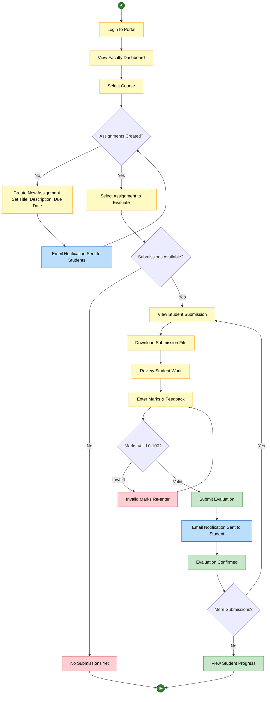

# Activity Flow Diagram - Faculty Evaluation Process

## Smart Learn - Academic Portal System

```mermaid
flowchart TD
    Start(("●"))

    Login["Login to Portal"]
    Dashboard["View Faculty Dashboard"]
    SelectCourse["Select Course"]

    CheckAssignments{"Assignments Created?"}
    CreateAssignment["Create New Assignment Set Title, Description, Due Date"]
    NotifyStudents["Email Notification Sent to Students"]

    SelectAssignment["Select Assignment to Evaluate"]
    CheckSubmissions{"Submissions Available?"}
    NoSubmissions["No Submissions Yet"]

    ViewSubmission["View Student Submission"]
    DownloadFile["Download Submission File"]
    ReviewWork["Review Student Work"]

    ValidateMarks{"Marks Valid 0-100?"}
    InvalidMarks["Invalid Marks Re-enter"]
    EnterMarks["Enter Marks & Feedback"]

    SubmitEvaluation["Submit Evaluation"]
    NotifyStudent["Email Notification Sent to Student"]
    ConfirmEvaluation["Evaluation Confirmed"]

    MoreSubmissions{"More Submissions?"}
    ViewProgress["View Student Progress"]

    End(("◉"))

    %% Flow
    Start --> Login
    Login --> Dashboard
    Dashboard --> SelectCourse
    SelectCourse --> CheckAssignments

    CheckAssignments -->|No| CreateAssignment
    CreateAssignment --> NotifyStudents
    NotifyStudents --> CheckAssignments
    CheckAssignments -->|Yes| SelectAssignment

    SelectAssignment --> CheckSubmissions
    CheckSubmissions -->|No| NoSubmissions
    NoSubmissions --> End
    CheckSubmissions -->|Yes| ViewSubmission

    ViewSubmission --> DownloadFile
    DownloadFile --> ReviewWork
    ReviewWork --> EnterMarks

    EnterMarks --> ValidateMarks
    ValidateMarks -->|Invalid| InvalidMarks
    InvalidMarks --> EnterMarks
    ValidateMarks -->|Valid| SubmitEvaluation

    SubmitEvaluation --> NotifyStudent
    NotifyStudent --> ConfirmEvaluation
    ConfirmEvaluation --> MoreSubmissions

    MoreSubmissions -->|Yes| ViewSubmission
    MoreSubmissions -->|No| ViewProgress
    ViewProgress --> End

    %% Styling
    style Start fill:#2e7d32,stroke:#1b5e20,color:#fff
    style End fill:#2e7d32,stroke:#1b5e20,color:#fff
    style Login fill:#fff9c4,stroke:#f9a825,color:#000
    style Dashboard fill:#fff9c4,stroke:#f9a825,color:#000
    style SelectCourse fill:#fff9c4,stroke:#f9a825,color:#000
    style SelectAssignment fill:#fff9c4,stroke:#f9a825,color:#000
    style CreateAssignment fill:#fff9c4,stroke:#f9a825,color:#000
    style ViewSubmission fill:#fff9c4,stroke:#f9a825,color:#000
    style DownloadFile fill:#fff9c4,stroke:#f9a825,color:#000
    style ReviewWork fill:#fff9c4,stroke:#f9a825,color:#000
    style EnterMarks fill:#fff9c4,stroke:#f9a825,color:#000
    style SubmitEvaluation fill:#c8e6c9,stroke:#388e3c,color:#000
    style ConfirmEvaluation fill:#c8e6c9,stroke:#388e3c,color:#000
    style NotifyStudents fill:#bbdefb,stroke:#1565c0,color:#000
    style NotifyStudent fill:#bbdefb,stroke:#1565c0,color:#000
    style ViewProgress fill:#c8e6c9,stroke:#388e3c,color:#000
    style InvalidMarks fill:#ffcdd2,stroke:#c62828,color:#000
    style NoSubmissions fill:#ffcdd2,stroke:#c62828,color:#000
```
