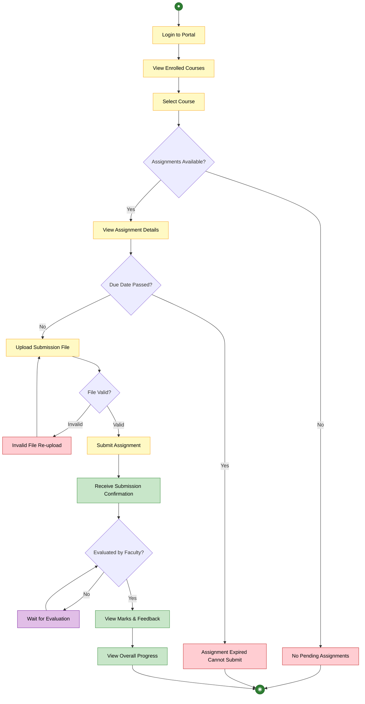

# Activity Flow Diagram - Student Assignment Submission

## Smart Learn - Academic Portal System

```mermaid
flowchart TD
    Start(("●"))

    %% Student Side
    Login["Login to Portal"]
    ViewCourses["View Enrolled Courses"]
    SelectCourse["Select Course"]

    CheckAssignments{"Assignments Available?"}
    NoAssignment["No Pending Assignments"]

    ViewAssignment["View Assignment Details"]
    CheckDueDate{"Due Date Passed?"}
    Expired["Assignment Expired Cannot Submit"]

    UploadFile["Upload Submission File"]
    ValidateFile{"File Valid?"}
    InvalidFile["Invalid File Re-upload"]

    SubmitAssignment["Submit Assignment"]
    ConfirmSubmission["Receive Submission Confirmation"]

    CheckEvaluation{"Evaluated by Faculty?"}
    WaitEvaluation["Wait for Evaluation"]

    ViewMarks["View Marks & Feedback"]
    ViewProgress["View Overall Progress"]

    End(("◉"))

    %% Flow
    Start --> Login
    Login --> ViewCourses
    ViewCourses --> SelectCourse
    SelectCourse --> CheckAssignments

    CheckAssignments -->|Yes| ViewAssignment
    CheckAssignments -->|No| NoAssignment
    NoAssignment --> End

    ViewAssignment --> CheckDueDate
    CheckDueDate -->|Yes| Expired
    Expired --> End
    CheckDueDate -->|No| UploadFile

    UploadFile --> ValidateFile
    ValidateFile -->|Invalid| InvalidFile
    InvalidFile --> UploadFile
    ValidateFile -->|Valid| SubmitAssignment

    SubmitAssignment --> ConfirmSubmission
    ConfirmSubmission --> CheckEvaluation

    CheckEvaluation -->|No| WaitEvaluation
    WaitEvaluation --> CheckEvaluation
    CheckEvaluation -->|Yes| ViewMarks

    ViewMarks --> ViewProgress
    ViewProgress --> End

    %% Styling
    style Start fill:#2e7d32,stroke:#1b5e20,color:#fff
    style End fill:#2e7d32,stroke:#1b5e20,color:#fff
    style Login fill:#fff9c4,stroke:#f9a825,color:#000
    style ViewCourses fill:#fff9c4,stroke:#f9a825,color:#000
    style SelectCourse fill:#fff9c4,stroke:#f9a825,color:#000
    style ViewAssignment fill:#fff9c4,stroke:#f9a825,color:#000
    style UploadFile fill:#fff9c4,stroke:#f9a825,color:#000
    style SubmitAssignment fill:#fff9c4,stroke:#f9a825,color:#000
    style ConfirmSubmission fill:#c8e6c9,stroke:#388e3c,color:#000
    style ViewMarks fill:#c8e6c9,stroke:#388e3c,color:#000
    style ViewProgress fill:#c8e6c9,stroke:#388e3c,color:#000
    style Expired fill:#ffcdd2,stroke:#c62828,color:#000
    style InvalidFile fill:#ffcdd2,stroke:#c62828,color:#000
    style NoAssignment fill:#ffcdd2,stroke:#c62828,color:#000
    style WaitEvaluation fill:#e1bee7,stroke:#7b1fa2,color:#000
```
