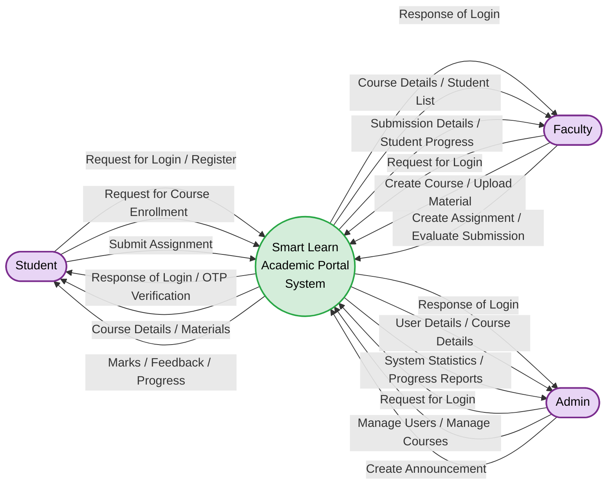

# Context-Level Data Flow Diagram (DFD Level 0)

## Smart Learn - Academic Portal System

```mermaid
graph LR
    %% External Entities
    Student([Student])
    Faculty([Faculty])
    Admin([Admin])

    %% Central Process
    System((Smart Learn\nAcademic Portal\nSystem))

    %% Student Flows
    Student -->|Request for Login / Register| System
    System -->|Response of Login / OTP Verification| Student
    Student -->|Request for Course Enrollment| System
    System -->|Course Details / Materials| Student
    Student -->|Submit Assignment| System
    System -->|Marks / Feedback / Progress| Student

    %% Faculty Flows
    Faculty -->|Request for Login| System
    System -->|Response of Login| Faculty
    Faculty -->|Create Course / Upload Material| System
    System -->|Course Details / Student List| Faculty
    Faculty -->|Create Assignment / Evaluate Submission| System
    System -->|Submission Details / Student Progress| Faculty

    %% Admin Flows
    Admin -->|Request for Login| System
    System -->|Response of Login| Admin
    Admin -->|Manage Users / Manage Courses| System
    System -->|User Details / Course Details| Admin
    Admin -->|Create Announcement| System
    System -->|System Statistics / Progress Reports| Admin

    %% Styling
    style System fill:#d4edda,stroke:#28a745,stroke-width:2px,color:#000
    style Student fill:#e8d5f5,stroke:#7b2d8e,stroke-width:2px,color:#000
    style Faculty fill:#e8d5f5,stroke:#7b2d8e,stroke-width:2px,color:#000
    style Admin fill:#e8d5f5,stroke:#7b2d8e,stroke-width:2px,color:#000
```
