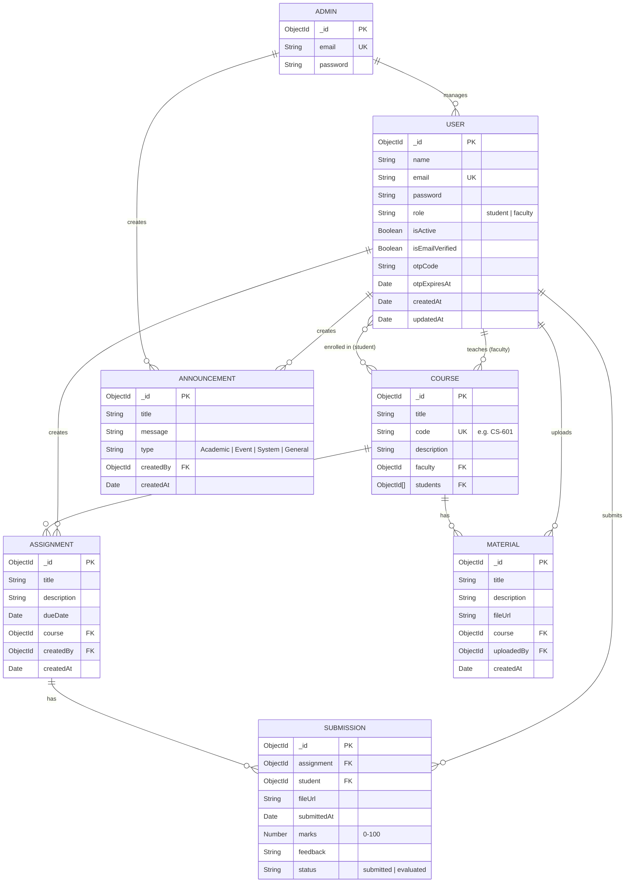

# Entity-Relationship Diagram (ER Diagram)

## Smart Learn - Academic Portal System

```mermaid
erDiagram
    USER {
        ObjectId _id PK
        String name
        String email UK
        String password
        String role "student | faculty"
        Boolean isActive
        Boolean isEmailVerified
        String otpCode
        Date otpExpiresAt
        Date createdAt
        Date updatedAt
    }

    ADMIN {
        ObjectId _id PK
        String email UK
        String password
    }

    COURSE {
        ObjectId _id PK
        String title
        String code UK "e.g. CS-601"
        String description
        ObjectId faculty FK
        ObjectId[] students FK
    }

    ASSIGNMENT {
        ObjectId _id PK
        String title
        String description
        Date dueDate
        ObjectId course FK
        ObjectId createdBy FK
        Date createdAt
    }

    MATERIAL {
        ObjectId _id PK
        String title
        String description
        String fileUrl
        ObjectId course FK
        ObjectId uploadedBy FK
        Date createdAt
    }

    SUBMISSION {
        ObjectId _id PK
        ObjectId assignment FK
        ObjectId student FK
        String fileUrl
        Date submittedAt
        Number marks "0-100"
        String feedback
        String status "submitted | evaluated"
    }

    ANNOUNCEMENT {
        ObjectId _id PK
        String title
        String message
        String type "Academic | Event | System | General"
        ObjectId createdBy FK
        Date createdAt
    }

    %% Relationships

    USER ||--o{ COURSE : "teaches (faculty)"
    USER }o--o{ COURSE : "enrolled in (student)"

    USER ||--o{ MATERIAL : "uploads"
    USER ||--o{ ASSIGNMENT : "creates"
    USER ||--o{ SUBMISSION : "submits"
    USER ||--o{ ANNOUNCEMENT : "creates"

    COURSE ||--o{ ASSIGNMENT : "has"
    COURSE ||--o{ MATERIAL : "has"

    ASSIGNMENT ||--o{ SUBMISSION : "has"

    ADMIN ||--o{ ANNOUNCEMENT : "creates"
    ADMIN ||--o{ USER : "manages"
```
