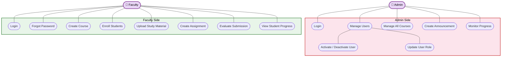

# UML Use Case Diagram - Admin & Faculty Side

## Smart Learn - Academic Portal System

```mermaid
graph TD
    %% Actors
    AdminActor(["👤 Admin"])
    FacultyActor(["👤 Faculty"])

    %% Admin Side Use Cases
    subgraph AdminSide["Admin Side"]
        AdminLogin([Login])
        ManageUsers([Manage Users])
        ManageCourses([Manage All Courses])
        CreateAnnouncement([Create Announcement])
        MonitorProgress([Monitor Progress])
        ActivateDeactivateUser([Activate / Deactivate User])
        UpdateUserRole([Update User Role])
    end

    %% Faculty Side Use Cases
    subgraph FacultySide["Faculty Side"]
        FacultyLogin([Login])
        ForgotPassword([Forgot Password])
        CreateCourse([Create Course])
        EnrollStudents([Enroll Students])
        UploadMaterial([Upload Study Material])
        CreateAssignment([Create Assignment])
        EvaluateSubmission([Evaluate Submission])
        ViewStudentProgress([View Student Progress])
    end

    %% Admin Connections
    AdminActor --- AdminLogin
    AdminActor --- ManageUsers
    AdminActor --- ManageCourses
    AdminActor --- CreateAnnouncement
    AdminActor --- MonitorProgress
    ManageUsers --- ActivateDeactivateUser
    ManageUsers --- UpdateUserRole

    %% Faculty Connections
    FacultyActor --- FacultyLogin
    FacultyActor --- ForgotPassword
    FacultyActor --- CreateCourse
    FacultyActor --- EnrollStudents
    FacultyActor --- UploadMaterial
    FacultyActor --- CreateAssignment
    FacultyActor --- EvaluateSubmission
    FacultyActor --- ViewStudentProgress

    %% Styling
    style AdminSide fill:#fce4ec,stroke:#c62828,stroke-width:2px,color:#000
    style FacultySide fill:#e8f5e9,stroke:#2e7d32,stroke-width:2px,color:#000
    style AdminActor fill:#e8d5f5,stroke:#7b2d8e,stroke-width:2px,color:#000
    style FacultyActor fill:#e8d5f5,stroke:#7b2d8e,stroke-width:2px,color:#000
```
