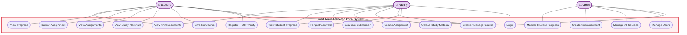

# UML Use Case Diagram

## Smart Learn - Academic Portal System

```mermaid
graph TD
    %% Actors
    StudentActor(["👤 Student"])
    FacultyActor(["👤 Faculty"])
    AdminActor(["👤 Admin"])

    %% System Boundary
    subgraph SmartLearn["Smart Learn Academic Portal System"]

        %% Shared Use Cases
        Login([Login])
        ForgotPassword([Forgot Password])
        ViewAnnouncements([View Announcements])

        %% Student Use Cases
        Register([Register + OTP Verify])
        EnrollCourse([Enroll in Course])
        ViewMaterials([View Study Materials])
        ViewAssignments([View Assignments])
        SubmitAssignment([Submit Assignment])
        ViewProgress([View Progress])

        %% Faculty Use Cases
        CreateCourse([Create / Manage Course])
        UploadMaterial([Upload Study Material])
        CreateAssignment([Create Assignment])
        EvaluateSubmission([Evaluate Submission])
        ViewStudentProgress([View Student Progress])

        %% Admin Use Cases
        ManageUsers([Manage Users])
        ManageCourses([Manage All Courses])
        CreateAnnouncement([Create Announcement])
        MonitorProgress([Monitor Student Progress])
    end

    %% Student Connections
    StudentActor --- Login
    StudentActor --- Register
    StudentActor --- ForgotPassword
    StudentActor --- EnrollCourse
    StudentActor --- ViewMaterials
    StudentActor --- ViewAssignments
    StudentActor --- SubmitAssignment
    StudentActor --- ViewProgress
    StudentActor --- ViewAnnouncements

    %% Faculty Connections
    FacultyActor --- Login
    FacultyActor --- ForgotPassword
    FacultyActor --- CreateCourse
    FacultyActor --- UploadMaterial
    FacultyActor --- CreateAssignment
    FacultyActor --- EvaluateSubmission
    FacultyActor --- ViewStudentProgress
    FacultyActor --- ViewAnnouncements

    %% Admin Connections
    AdminActor --- Login
    AdminActor --- ManageUsers
    AdminActor --- ManageCourses
    AdminActor --- CreateAnnouncement
    AdminActor --- MonitorProgress

    %% Styling
    style SmartLearn fill:#fff0f0,stroke:#dc3545,stroke-width:2px,color:#000
    style StudentActor fill:#e8d5f5,stroke:#7b2d8e,stroke-width:2px,color:#000
    style FacultyActor fill:#e8d5f5,stroke:#7b2d8e,stroke-width:2px,color:#000
    style AdminActor fill:#e8d5f5,stroke:#7b2d8e,stroke-width:2px,color:#000
```
