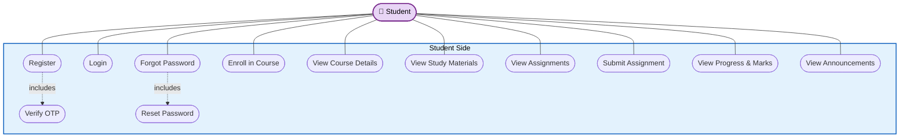

# UML Use Case Diagram - Student Side

## Smart Learn - Academic Portal System

```mermaid
graph TD
    %% Actor
    StudentActor(["👤 Student"])

    %% Student Use Cases
    subgraph StudentSide["Student Side"]
        Register([Register])
        VerifyOTP([Verify OTP])
        Login([Login])
        ForgotPassword([Forgot Password])
        ResetPassword([Reset Password])
        EnrollCourse([Enroll in Course])
        ViewCourseDetails([View Course Details])
        ViewMaterials([View Study Materials])
        ViewAssignments([View Assignments])
        SubmitAssignment([Submit Assignment])
        ViewProgress([View Progress & Marks])
        ViewAnnouncements([View Announcements])
    end

    %% Student Connections
    StudentActor --- Register
    StudentActor --- Login
    StudentActor --- ForgotPassword
    StudentActor --- EnrollCourse
    StudentActor --- ViewCourseDetails
    StudentActor --- ViewMaterials
    StudentActor --- ViewAssignments
    StudentActor --- SubmitAssignment
    StudentActor --- ViewProgress
    StudentActor --- ViewAnnouncements

    %% Extend / Include relationships
    Register -.->|includes| VerifyOTP
    ForgotPassword -.->|includes| ResetPassword

    %% Styling
    style StudentSide fill:#e3f2fd,stroke:#1565c0,stroke-width:2px,color:#000
    style StudentActor fill:#e8d5f5,stroke:#7b2d8e,stroke-width:2px,color:#000
```
